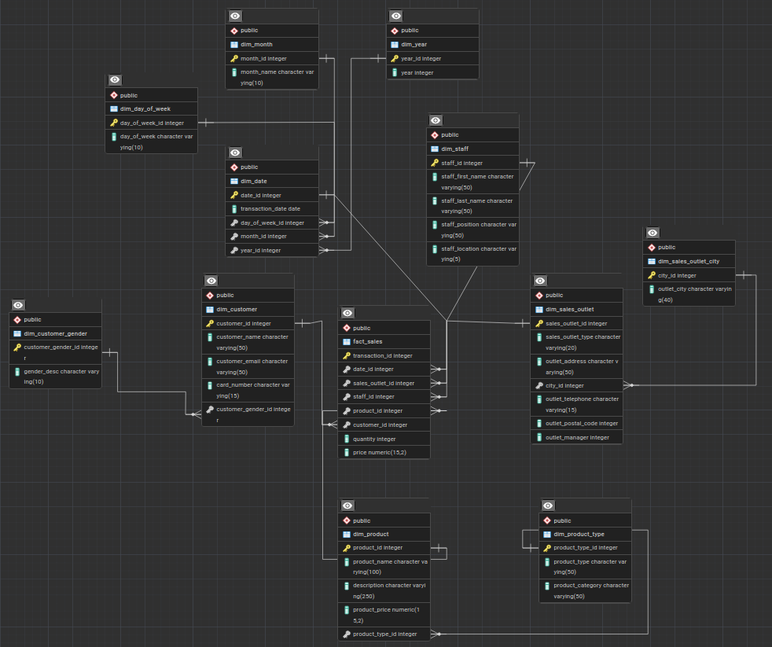

# Data Pipeline Using Airflow, PostgreSQL (with Amazon Aurora), and MySQL

This repository contains multiple scripts that you can use to automate data transfer and transformation from MySQL to your production database in Postgres. I include the Airflow DAG script here `airflow_data_transfer_automatic_runs.py` (located inside the `dags` folder), which you can use in Airflow to automate the other two scripts: `data_transfer_from_mysql.py` (to transfer data from MySQL to Staging Area database in Postgres), and `etl_from_staging_to_aurora.py` (to transfer data from Staging Area to Amazon Aurora PostgreSQL, with extra PII masking in the middle of the process).

For this repository, I use the classic approach, with the utilization of .env file for local environment settings. In actual production, you may want to configure your database credentials inside Airflow Connections directly.

The repository also include multiple SQL scripts that you should execute manually before running the Airflow DAG script. The original data is also included in a CSV format inside the `transaction_data` folder.

**Note:** If you don't want to use Amazon Aurora, you can store the data in local Postgres. For this, use my standard script `etl_from_staging.py` instead of `etl_from_staging_to_aurora.py`.

The two scripts (`etl_from_staging.py` and `etl_from_staging_to_aurora.py`) are very similar, but I put `sslmode='require'` for Amazon Aurora connection to enforce encryption.

## Project Structure

The project is structured as follows:

- `01_create_table_mysql.sql`: Execute this SQL script to create the transaction_data table in MySQL
- `02_update_empty_string_mysql.sql`: SQL script to update empty strings in MySQL, so they will become NULL. You should only execute this script after uploading the initial data into your MySQL database.
- `03_create_table_staging_area_postgres.sql`: SQL script to create the table in the staging area in Postgres.
- `04_insert_initial_records_postgres.sql`: SQL script to insert initial records into the staging area in local Postgres.
- `05_create_snowflake_schema_postgres.sql`: SQL script to create the tables in a Snowflake schema for the production database in local Postgres (for Amazon Aurora PostgreSQL, skip this SQL file, and execute `create_snowflake_schema_postgres_aurora.py` instead)
- `data_transfer_from_mysql.py`: Python script to transfer data from MySQL to staging area in local Postgres.
- `etl_from_staging.py`: Python script to transfer data from the staging area into the production database in local Postgres.
- `etl_from_staging_to_aurora.py`: Very similar to `etl_from_staging.py` but the data will be saved to Amazon Aurora Postgres.
- `check_mysql.py`: Python script to check the first five rows in the MySQL table. It's only triggered once in the first Airflow DAG run if you use `airflow_data_transfer_automatic_runs.py`.
- `airflow_data_transfer_automatic_runs.py`: Located inside the `dags` folder, this is the Airflow DAG script to automate the data pipeline using Airflow. This script will automatically re-execute the DAG after it finishes every single time.
- `airflow_data_transfer_original.py`: Also located inside the `dags` folder, this is the original Airflow DAG script, where you will run the tasks with manual time intervals (without automatic runs).

The `transaction_data` folder contains the CSV file which should be used to fill the table in your MySQL database.

## How to Use

1. Ensure you have MySQL, PostgreSQL, and Airflow installed and running on your machine.

2. In MySQL, create a new database, and execute `01_create_table_mysql.sql` inside it. Make sure to include the database name that you choose in your .env file (check `.env.example` for the structure)

3. Use PHPMyAdmin to import the included CSV file `transaction_data.csv` (inside the `transaction_data` folder) into your transaction_data table that's created by the firt SQL script above.

4. Once your transaction_data table in MySQL is filled with the data from the CSV file, you can proceed to execute `02_update_empty_string_mysql.sql`, which should update all the empty string values to become actually NULL values.

5. Go to local Postgres, and create a database for the staging area. Inside that database, execute `03_create_table_staging_area_postgres.sql` and `04_insert_initial_records_postgres.sql`. The staging area database details should be included in your .env file.

6. Next, create the production database in Amazon Aurora PostgreSQL, and execute the script `create_snowflake_schema_postgres_aurora.py`, which will create your tables in a snowflake schema. And just like step 2 and 5 above, you should also include your Amazon Aurora database details in your .env file.

    For 'target_db_host_aurora', you should be able to find the IP address easily by using the ping command to your Aurora cluster endpoint in terminal. Also, don't forget to edit the inbound rules of the security group associated with your Aurora database instance to allow incoming connections from the script's source. This ensures you won't have any connection issues when the script attempts to connect to Aurora.

    If you don't want to use Amazon Aurora, you can simply create your production database in local Postgres, and execute `05_create_snowflake_schema_postgres.sql` instead.

7. Once you are done with all the 6 steps above, you can then place the Airflow DAG script `airflow_data_transfer_automatic_runs.py` into the "dags" subfolder of your repository where you have installed Airflow. Feel free to change the sys.path to the folder where you personally store the Python data transfer and ETL scripts (`data_transfer_from_mysql.py` and `etl_from_staging_to_aurora.py`). In the current setup, the data transfer and ETL scripts are stored in the parent folder of the DAG script. Also, if the DAG script file has permission issues (after you move it), you have to change its permission.

    If you don't use Amazon Aurora, you can change all mentions of 'etl_from_staging_to_aurora' to 'etl_from_staging' in the Airflow DAG script.

8. If you see no issues with the DAG script file in Airflow, you can simply unpause it with the command `airflow dags unpause airflow_data_transfer_automatic_runs`. You can also trigger the DAG directly using the Airflow UI. Make sure both the Airflow server and scheduler are running properly. That's it! 

Everything is automated once the DAG is up and running! If you want to speed up the data transfer process, feel free to increase the transfer limit (from 100 records) inside `data_transfer_from_mysql.py` and `etl_from_staging_to_aurora.py` (or `etl_from_staging.py`)

The final ERD design in your production database should look like the below image:

